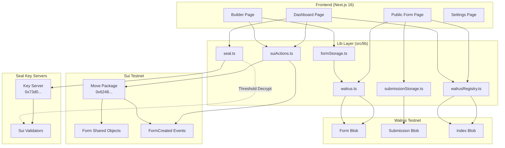
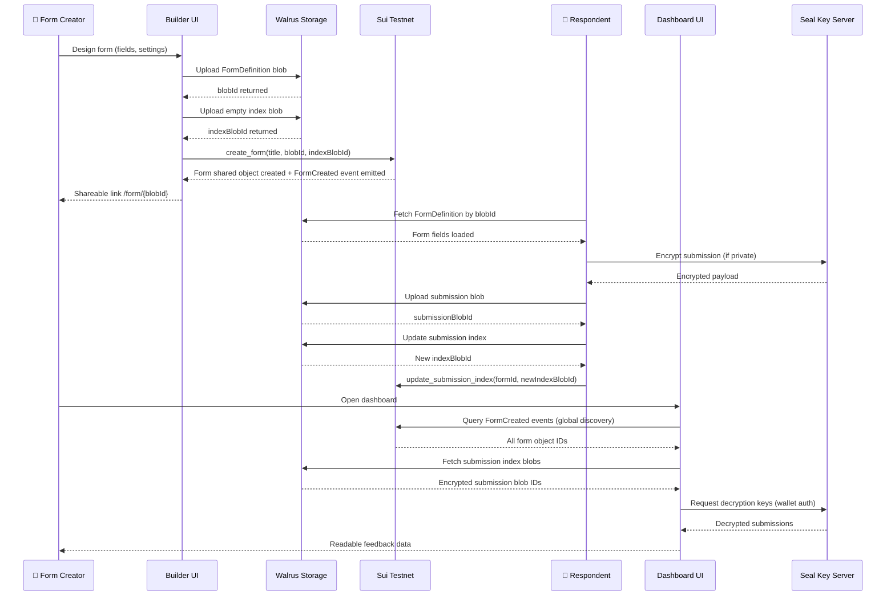
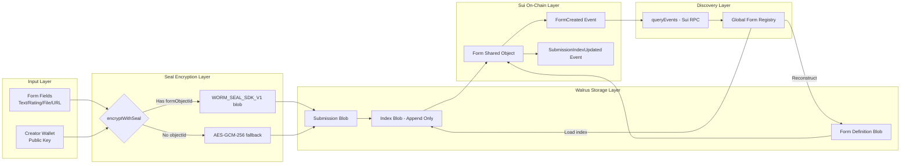
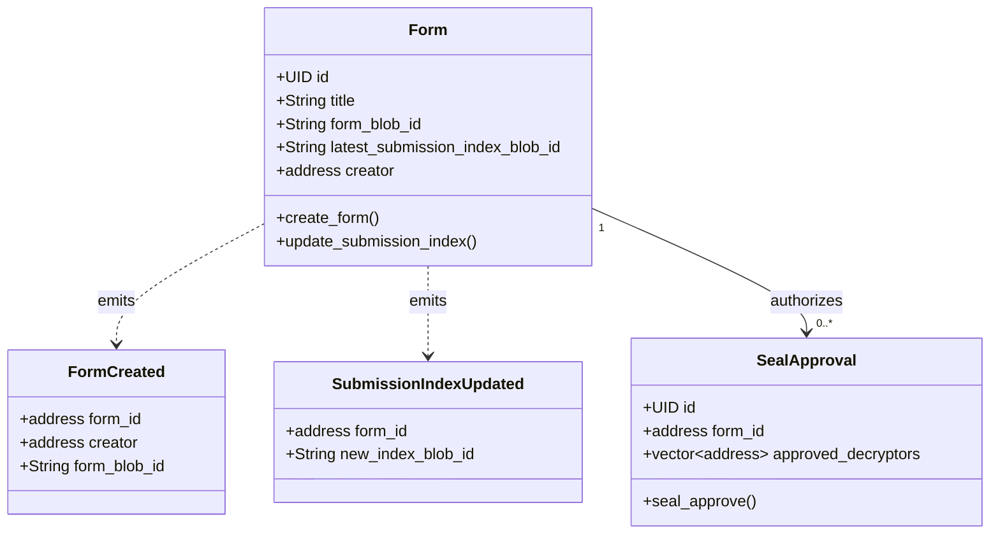
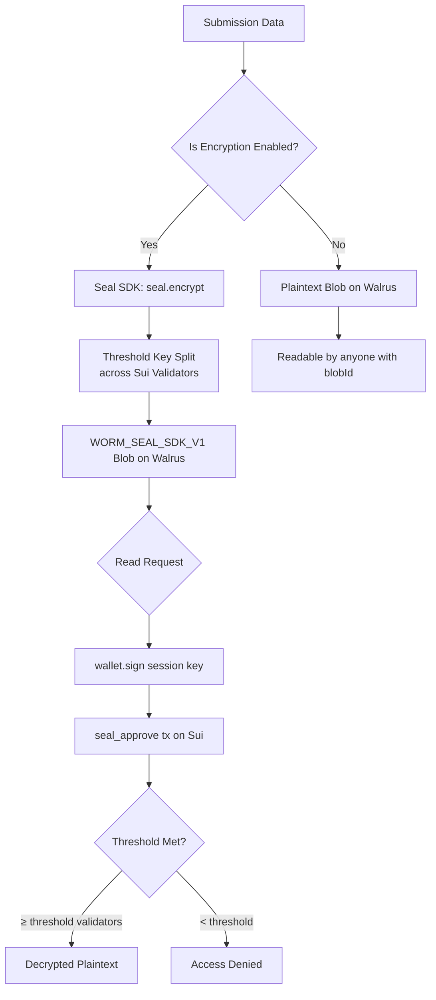
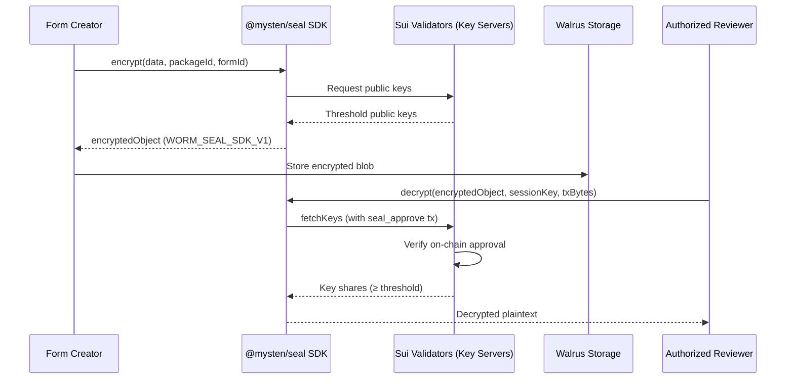
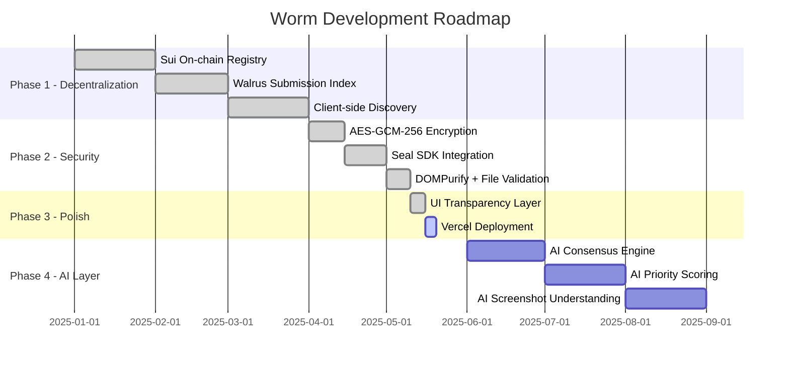

<div align="center">
  

  <h1>Worm — Decentralized Feedback Infrastructure</h1>

  <p>
    <strong>Build. Deploy. Collect. Verify.</strong><br/>
    A fully decentralized form builder and feedback coordination platform powered by <strong>Sui</strong>, <strong>Walrus</strong>, and <strong>Seal</strong>.
  </p>

  <p>
    <a href="https://nextjs.org/"></a>
    <a href="https://sui.io/"></a>
    <a href="https://walrus.site/"></a>
    <a href="https://sdk.mystenlabs.com/seal"></a>
    <a href="https://www.typescriptlang.org/"></a>
  </p>
</div>

---

## 📖 Table of Contents

1. [Overview](#overview)
2. [Core Architecture](#core-architecture)
3. [System Architecture Diagram](#system-architecture-diagram)
4. [User Flow Diagram](#user-flow-diagram)
5. [Data Flow Diagram](#data-flow-diagram)
6. [Smart Contract Architecture](#smart-contract-architecture)
7. [Security Model](#security-model)
8. [Features](#features)
9. [Tech Stack](#tech-stack)
10. [Project Structure](#project-structure)
11. [Getting Started](#getting-started)
12. [Environment Variables](#environment-variables)
13. [Move Package Deployment](#move-package-deployment)
14. [End-to-End Testing](#end-to-end-testing)
15. [How Seal Encryption Works](#how-seal-encryption-works)
16. [Roadmap](#roadmap)
17. [Contributing](#contributing)

---

## Overview

**Worm** is not just a form builder. It is a **verifiable feedback coordination infrastructure** built entirely on decentralized primitives.

Every form, submission, and response index lives on the **Walrus decentralized blob storage** network, with ownership and discovery enforced by a **Sui Move smart contract**. Sensitive submissions are protected by **@mysten/seal**, a threshold encryption protocol where decryption keys are distributed across Sui validators — not held by any single server.

### Why Worm?

| Traditional Forms | Worm |
|---|---|
| Data on company servers | Data on Walrus (immutable, decentralized) |
| Centralized indexer required | Client-side Sui event-based discovery |
| Trust the platform for privacy | Cryptographic guarantee via Seal |
| Device-dependent dashboard | Wallet-based, fully portable |
| Vulnerable to censorship | Immutable + chain-anchored |

---

## Core Architecture

Worm is built on three decentralized layers:

```
┌─────────────────────────────────────────────────────┐
│                   WORM PLATFORM                      │
│                                                     │
│  ┌──────────────┐  ┌───────────────┐  ┌──────────┐ │
│  │  Sui Network │  │    Walrus     │  │   Seal   │ │
│  │  (Registry & │  │  (Immutable  │  │(Threshold│ │
│  │  Discovery)  │  │   Storage)   │  │ Encrypt) │ │
│  └──────────────┘  └───────────────┘  └──────────┘ │
└─────────────────────────────────────────────────────┘
```

1. **Sui Network**: Stores form metadata as shared objects. Emits `FormCreated` events for global discovery. Enforces the Seal access control policy via `seal_approve`.

2. **Walrus**: Stores the actual form definitions and submissions as immutable blobs. Maintains an append-only submission index per form.

3. **Seal SDK**: Provides threshold encryption for private submissions. Keys are distributed across the Sui validator set — no single point of compromise.

---

## System Architecture Diagram



---

## User Flow Diagram



---

## Data Flow Diagram



---

## Smart Contract Architecture



**Deployed Package ID:**
```
0x624805e8d931a770ebc5426a72797fc74b7f100cfb0083d67d77d48558fa5e83
```

**Network:** Sui Testnet

---

## Security Model



### Security Layers

| Layer | Technology | Protection |
|---|---|---|
| **Encryption** | @mysten/seal (threshold) + AES-GCM-256 | Submission data encrypted before Walrus upload |
| **Key Distribution** | Sui Validators | No single server holds decryption keys |
| **Access Control** | Move `seal_approve` | On-chain ACL enforces allowed decryptors |
| **Content Safety** | DOMPurify | XSS prevention on rich text rendering |
| **Storage Integrity** | Walrus (immutable blobs) | Submissions cannot be tampered with post-upload |

---

## Features

### 🏗️ Form Builder
- **Drag-to-reorder** fields with Framer Motion Reorder
- **9 field types**: Text, Rich Text, Dropdown, Checkbox, Star Rating, Screenshot, Video, URL, Confirmation
- **Settings tab**: Configure Seal encryption policy, authorized decryptors, wallet requirements
- **Live preview**: Switch between builder and preview modes
- **Glassmorphism UI**: Premium design with Syne + Jakarta Sans typography

### 📡 Decentralized Deployment
- Form definitions uploaded as **immutable Walrus blobs**
- Registered on **Sui Testnet** via `create_form` Move function
- Generates a shareable link: `/form/{walrusBlobId}`
- **Real-time Activity Log** shows Seal → Walrus → Sui stages

### 📝 Public Form Submission
- Form definition fetched directly from Walrus (no backend)
- Submissions encrypted by Seal SDK before storage
- Immutable submission blob uploaded to Walrus
- Submission index updated on-chain via `update_submission_index`
- **Progress stages**: `Seal: Securing...` → `Walrus: Storing...` → `Walrus: Indexing...`

### 📊 Admin Dashboard
- **Global discovery** via Sui event queries — no indexer server needed
- **Sync status indicators**: Sui Sync → Walrus Sync → Seal Decrypting → Verified
- Filter responses by form, search by content
- **Slide-over detail panel** with decrypted answers
- **Status management**: New → In Review → Actioned → Archived
- **Internal notes** (local, encrypted at rest)
- **CSV export** via PapaParse
- **"View on Walrus"** link for each response blob

### 🔐 Seal Encryption
- Uses `@mysten/seal` v1.1.3 SDK
- Key server: `0x73d05d62c18d9374e3ea529e8e0ed6161da1a141a94d3f76ae3fe4e99356db75`
- AES-GCM-256 fallback when formObjectId is unavailable
- Dual-prefix detection: `WORM_SEAL_SDK_V1` and `WORM_AES_GCM_V1`

---

## Tech Stack

| Category | Technology |
|---|---|
| **Framework** | Next.js 16.2.4 (App Router, Turbopack) |
| **Language** | TypeScript 5.x |
| **Blockchain** | Sui Testnet (Move language) |
| **Storage** | Walrus Testnet |
| **Encryption** | @mysten/seal v1.1.3 + WebCrypto AES-GCM-256 |
| **Wallet** | @mysten/dapp-kit v1.0.6 |
| **Sui SDK** | @mysten/sui v2.16.2 |
| **Rich Text** | Tiptap v3 |
| **Animations** | Framer Motion v12 |
| **Content Safety** | DOMPurify v3 |
| **CSV Export** | PapaParse v5 |
| **Styling** | Tailwind CSS v4 + Vanilla CSS |

---

## Project Structure

```
walrusform/
├── move_worm/                    # Sui Move smart contract
│   └── sources/
│       └── worm.move             # Form registry + Seal approval
│
├── src/
│   ├── app/
│   │   ├── builder/page.tsx      # Form builder with activity log
│   │   ├── dashboard/page.tsx    # Admin dashboard with sync status
│   │   ├── form/[id]/page.tsx    # Public submission form
│   │   ├── settings/page.tsx     # Platform settings
│   │   ├── onboarding/page.tsx   # First-time user experience
│   │   └── templates/page.tsx    # Form templates
│   │
│   ├── components/
│   │   ├── ui/                   # GlassCard, Button, Badge, Input
│   │   ├── inputs/               # RichTextInput, FileUploadInput
│   │   ├── Navbar.tsx
│   │   ├── Hero.tsx
│   │   ├── FeaturesSection.tsx
│   │   └── AppBackground.tsx
│   │
│   └── lib/
│       ├── suiActions.ts         # Sui RPC: createFormTx, getAllForms, getFormByBlobId
│       ├── walrus.ts             # uploadToWalrus, readFromWalrus (with retry)
│       ├── seal.ts               # encryptWithSeal, decryptWithSeal (Seal SDK + AES fallback)
│       ├── formStorage.ts        # FormDefinition, saveFormDefinition, loadFormDefinition
│       ├── walrusRegistry.ts     # Decentralized index: append, load, merge
│       ├── submissionStorage.ts  # submitForm, getSubmissionsForForm
│       ├── contracts.ts          # Package ID, module, function constants
│       ├── csvExport.ts          # exportSubmissionsToCSV
│       └── e2e-autonomous.ts     # Autonomous E2E verification script
│
├── public/                       # Static assets (logo, mascot)
├── enhancement_plan.md           # Strategic roadmap
├── progress.md                   # Implementation progress log
└── WALRUSFORM_AGENT_PROMPT.md    # AI agent context file
```

---

## Getting Started

### Prerequisites

- **Node.js** ≥ 18
- **npm** ≥ 9
- **Sui CLI** (for Move deployment)
- **Walrus CLI** (for local testing)
- A **Sui wallet** (Slush, Sui Wallet) with Testnet SUI

### Install Dependencies

```bash
git clone https://github.com/your-org/walrusform.git
cd walrusform
npm install
```

### Run Development Server

```bash
npm run dev
```

Open [http://localhost:3000](http://localhost:3000)

### Build for Production

```bash
npm run build
npm run start
```

---

## Environment Variables

No environment variables are required for basic operation. The app uses public testnet endpoints:

| Endpoint | URL |
|---|---|
| Sui Testnet RPC | `https://fullnode.testnet.sui.io:443` |
| Walrus Publisher | `https://publisher.walrus-testnet.walrus.space` |
| Walrus Aggregator | `https://aggregator.walrus-testnet.walrus.space` |
| Seal Key Server | `0x73d05d62c18d9374e3ea529e8e0ed6161da1a141a94d3f76ae3fe4e99356db75` |

For production, you may configure custom RPC and Walrus endpoints by editing `src/lib/walrus.ts` and `src/lib/suiActions.ts`.

---

## Move Package Deployment

The Move smart contract is already deployed to Sui Testnet. To re-deploy or deploy to another network:

```bash
# Navigate to move package
cd move_worm

# Build the package
sui move build

# Deploy to testnet
sui client publish --gas-budget 100000000

# Note the published package ID and update src/lib/contracts.ts
```

Update `src/lib/contracts.ts` with your new package ID:

```typescript
export const WORM_PACKAGE_ID = "0x<your_new_package_id>";
```

### Move Module Summary

| Function | Description |
|---|---|
| `create_form` | Registers a new form on Sui, emits `FormCreated` event |
| `update_submission_index` | Updates the Walrus index pointer on-chain |
| `seal_approve` | Creates a `SealApproval` object for threshold decryption |

---

## End-to-End Testing

Worm includes an autonomous E2E verification script that tests the entire stack using the local Sui CLI and Walrus CLI:

```bash
npx tsx src/lib/e2e-autonomous.ts
```

**What it tests:**

1. ✅ Form Definition creation (TypeScript layer)
2. ✅ Walrus Upload (Publisher API)
3. ✅ Walrus Read (Aggregator API)
4. ✅ Sui Registration (`create_form` on-chain)
5. ✅ Seal Encryption (AES-GCM + SDK)
6. ✅ Submission upload to Walrus
7. ✅ Index update (on-chain pointer)
8. ✅ Global Discovery (event-based, no VPS)
9. ✅ Decryption Integrity

**Dashboard & Settings Test:**

```bash
npx tsx src/lib/verify-dashboard-settings.ts
```

---

## How Seal Encryption Works



**Key Properties:**
- **Threshold**: 1-of-N by default (configurable)
- **Identity namespace**: `formObjectId` — keys are bound to a specific form
- **Fallback**: AES-GCM-256 (PBKDF2) when `formObjectId` is unavailable
- **Session keys**: Generated per browser session, never persisted

---

## Roadmap



### Phase 4 — AI Intelligence Layer (Planned)

| Feature | Description |
|---|---|
| **AI Consensus Engine** | Analyze thousands of submissions to detect recurring pain points |
| **AI Priority Scoring** | Automatically score submissions by impact and frequency |
| **AI Root Cause Analysis** | Infer technical causes from community reports |
| **AI Duplicate Detection** | Cluster similar feedback into groups |
| **AI Smart Assistant** | Help respondents write higher-quality reports |
| **AI Screenshot Understanding** | Extract technical details from uploaded images |

---

## Contributing

1. **Fork** the repository
2. Create a **feature branch**: `git checkout -b feat/your-feature`
3. Make changes following the established patterns in `src/lib/`
4. Run the E2E verification: `npx tsx src/lib/e2e-autonomous.ts`
5. Open a **Pull Request**

### Code Conventions

- **No mocks in production paths** — all lib functions must call real Walrus/Sui endpoints
- **Type safety first** — avoid `any` in production code
- **Decentralized by default** — use Sui events for discovery, not localStorage
- **UI consistency** — use existing `GlassCard`, `Button`, `Badge` components only

---

<div align="center">
  <p>
    Built with ❤️ on <strong>Sui</strong> + <strong>Walrus</strong> + <strong>Seal</strong><br/>
    <em>Verifiable. Immutable. Decentralized.</em>
  </p>
  
</div>
