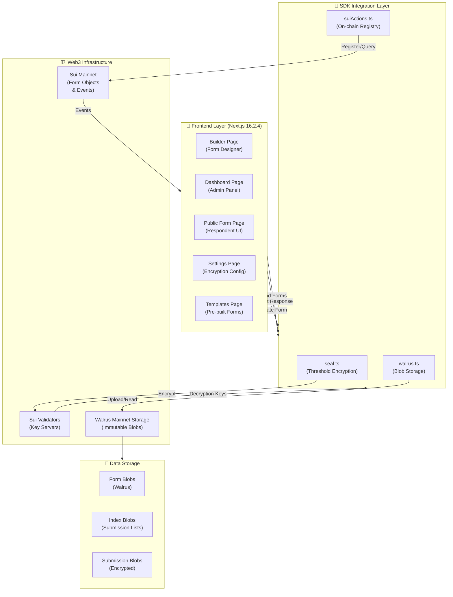
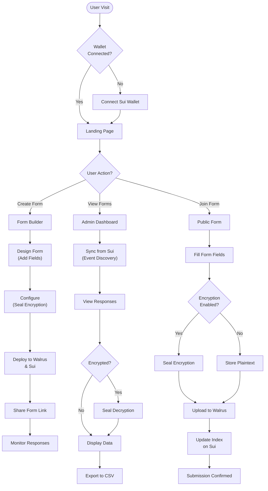
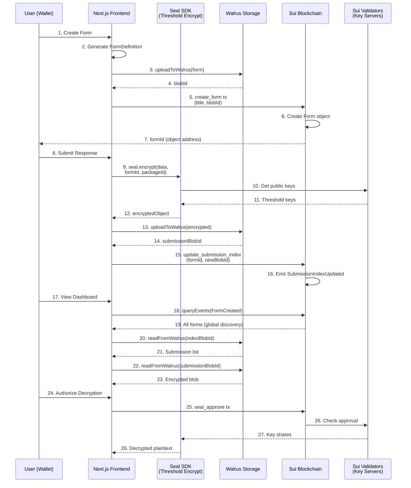
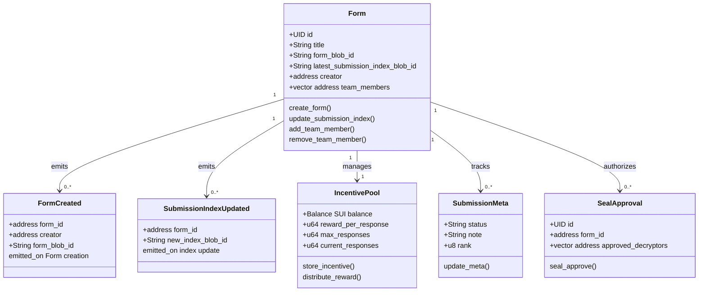
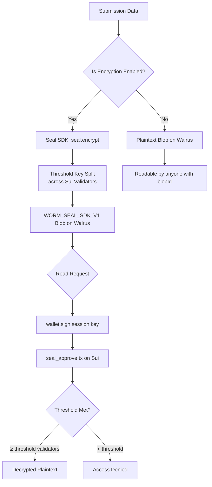
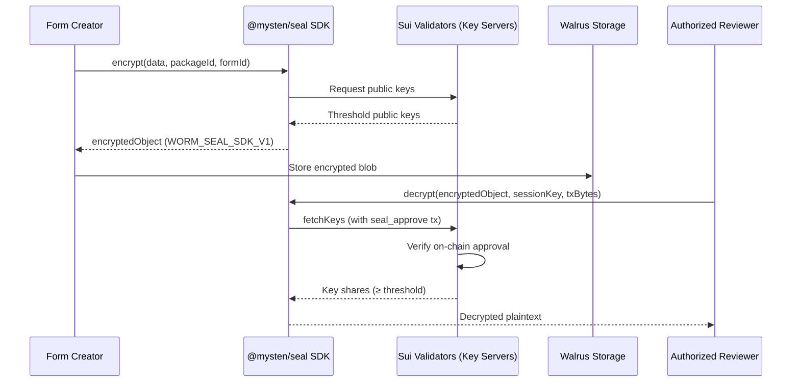
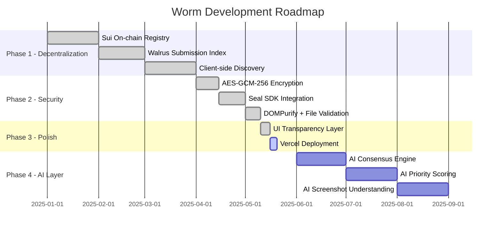

<div align="center">
  

  <h1>Worm — Decentralized Feedback Infrastructure</h1>

  <p>
    <strong>Build. Deploy. Collect. Verify.</strong><br/>
    A fully decentralized form builder and feedback coordination platform powered by <strong>Sui</strong>, <strong>Walrus</strong>, and <strong>Seal</strong>.
  </p>

  <p>
    <a href="https://nextjs.org/"></a>
    <a href="https://sui.io/"></a>
    <a href="https://walrus.site/"></a>
    <a href="https://sdk.mystenlabs.com/seal"></a>
    <a href="https://www.typescriptlang.org/"></a>
  </p>
</div>

---

## 📖 Table of Contents

1. [Overview](#overview)
2. [Core Architecture](#core-architecture)
3. [System Architecture Diagram](#system-architecture-diagram)
4. [User Flow Diagram](#user-flow-diagram)
5. [Data Flow Diagram](#data-flow-diagram)
6. [Smart Contract Architecture](#smart-contract-architecture)
7. [Contract Deployment Addresses](#contract-deployment-addresses)
8. [Smart Contract Functions Reference](#smart-contract-functions-reference)
9. [Security Model](#security-model)
10. [Features](#features)
11. [Tech Stack](#tech-stack)
12. [Project Structure](#project-structure)
13. [Getting Started](#getting-started)
14. [Environment Variables](#environment-variables)
15. [Move Package Deployment](#move-package-deployment)
16. [Mainnet Deployment Guide](#mainnet-deployment-guide)
17. [End-to-End Testing](#end-to-end-testing)
18. [How Seal Encryption Works](#how-seal-encryption-works)
19. [Roadmap](#roadmap)
20. [Self-Hosted Walrus Infrastructure](#self-hosted-walrus-infrastructure)
21. [Admin Tutorial: Adding Team Members (Decryptors)](#admin-tutorial-adding-team-members-decryptors)
22. [Troubleshooting](#troubleshooting)
23. [FAQ](#faq)
24. [Performance Optimization](#performance-optimization)
25. [Contributing](#contributing)

---

## Overview

**Worm** is not just a form builder. It is a **verifiable feedback coordination infrastructure** built entirely on decentralized primitives.

Every form, submission, and response index lives on the **Walrus decentralized blob storage** network, with ownership and discovery enforced by a **Sui Move smart contract**. Sensitive submissions are protected by **@mysten/seal**, a threshold encryption protocol where decryption keys are distributed across Sui validators — not held by any single server.

### Why Worm?

| Traditional Forms | Worm |
|---|---|
| Data on company servers | Data on Walrus (immutable, decentralized) |
| Centralized indexer required | Client-side Sui event-based discovery |
| Trust the platform for privacy | Cryptographic guarantee via Seal |
| Device-dependent dashboard | Wallet-based, fully portable |
| Vulnerable to censorship | Immutable + chain-anchored |

---

## Core Architecture

Worm is built on three decentralized layers:

```
┌─────────────────────────────────────────────────────┐
│                   WORM PLATFORM                      │
│                                                     │
│  ┌──────────────┐  ┌───────────────┐  ┌──────────┐ │
│  │  Sui Network │  │    Walrus     │  │   Seal   │ │
│  │  (Registry & │  │  (Immutable  │  │(Threshold│ │
│  │  Discovery)  │  │   Storage)   │  │ Encrypt) │ │
│  └──────────────┘  └───────────────┘  └──────────┘ │
└─────────────────────────────────────────────────────┘
```

1. **Sui Network**: Stores form metadata as shared objects. Emits `FormCreated` events for global discovery. Enforces the Seal access control policy via `seal_approve`.

2. **Walrus**: Stores the actual form definitions and submissions as immutable blobs. Maintains an append-only submission index per form.

3. **Seal SDK**: Provides threshold encryption for private submissions. Keys are distributed across the Sui validator set — no single point of compromise.

---

## System Architecture Diagram



---

## User Flow Diagram



---

## Data Flow Diagram



---

## Smart Contract Architecture



---

## Contract Deployment Addresses

### 📍 Mainnet Deployment

| Component | Address | Chain | Status |
|---|---|---|---|
| **Move Package** | `0x49b039b07d3738244258afac14c90364f89d3f68c1ded39a267fdf9c65819156` | Sui Mainnet | ✅ Live |
| **Upgrade Capability** | `0x4a1086b92b794c7e717b4045f1e1b971f454fd9305478089ee9b3abfffbcdd28` | Sui Mainnet | 🔐 Controlled |
| **Module** | `worm` | Sui Mainnet | ✅ Active |

### 🧪 Testnet Deployment

| Component | Address | Chain | Status |
|---|---|---|---|
| **Move Package** | `0x9752e3c1a621d17526b1bbe75ee0098151b3f392ce71035f39c0b835fc7a665b` | Sui Testnet | ✅ Live |
| **Upgrade Capability** | `0xb88863798d6e7295540cff9c6c7048f8288e98159cac49567a06d90768ca078a` | Sui Testnet | 🔐 Controlled |
| **Module** | `worm` | Sui Testnet | ✅ Active |
| **Seal Key Server** | `0x73d05d62c18d9374e3ea529e8e0ed6161da1a141a94d3f76ae3fe4e99356db75` | Sui Testnet | 🔐 Threshold Keys |

### 🔧 Build Configuration

```toml
[package.manifest]
name = "move_worm_v2"
version = "1.0.0"
edition = "2024"

[package.dependencies.Sui]
version = "1.70.2"
```

---

## Smart Contract Functions Reference

### Core Functions

#### `create_form`
Creates a new form on the Sui blockchain.

**Parameters:**
- `title: String` — Form title/name
- `form_blob_id: String` — Walrus blob ID containing form definition (JSON)
- `submission_index_blob_id: String` — Walrus blob ID for submission index (append-only)
- `ctx: &mut TxContext` — Transaction context

**Returns:**
- Shared `Form` object with unique address
- Emits `FormCreated` event

**Example:**
```move
create_form(
    b"Customer Feedback Survey".to_string(),
    b"Es7i4iw1l3xkak2o1buw2bz3j7bcj6wn1q9jfb3v".to_string(),
    b"Es7i4iw1l3xkak2o1buw2bz3j7bcj6wn1q9jfb3w".to_string(),
    &mut ctx
)
```

**On-Chain Result:**
- Form object stored in Sui state
- Globally discoverable via `FormCreated` event
- Creator holds rights to modify form and submissions

---

#### `update_submission_index`
Updates the submission index pointer on-chain after new submissions are added to Walrus.

**Parameters:**
- `form_id: address` — Address of the Form object
- `new_index_blob_id: String` — New Walrus blob ID containing updated submission index
- `ctx: &mut TxContext` — Transaction context

**Returns:**
- Updated Form object with new `latest_submission_index_blob_id`
- Emits `SubmissionIndexUpdated` event

**Example:**
```move
update_submission_index(
    0xabcd1234...,
    b"Es7i4iw1l3xkak2o1buw2bz3j7bcj6wn1q9jfb3x".to_string(),
    &mut ctx
)
```

**Event Emission:**
```move
event::emit(SubmissionIndexUpdated {
    form_id: @0xabcd1234,
    new_index_blob_id: b"Es7i4iw1l3xkak2o1buw2bz3j7bcj6wn1q9jfb3x",
})
```

---

#### `seal_approve`
Creates a Seal approval object for threshold-encrypted submissions. Authorizes specific addresses to decrypt submissions using Seal SDK.

**Parameters:**
- `form_id: address` — Address of the Form object
- `approved_decryptors: vector<address>` — Addresses authorized to decrypt submissions
- `ctx: &mut TxContext` — Transaction context

**Returns:**
- `SealApproval` object with list of authorized decryptors
- Stored as dynamic field on Form object

**Example:**
```move
seal_approve(
    0xabcd1234...,
    vector[0xdecrypt1, 0xdecrypt2],
    &mut ctx
)
```

**Security Note:**
- Only form creator can call this function
- Decryptors must have valid Sui addresses
- Threshold-encrypted submissions cannot be read without Seal approval

---

### Team & Access Control Functions

#### `add_team_member`
Adds a team member as co-owner of a form.

**Parameters:**
- `form_id: address` — Form object address
- `member_address: address` — Address to add
- `ctx: &mut TxContext` — Transaction context

**Security:**
- Only creator or existing team members can call
- New members gain full form management rights

---

#### `remove_team_member`
Removes a team member from form co-ownership.

**Parameters:**
- `form_id: address` — Form object address
- `member_address: address` — Address to remove
- `ctx: &mut TxContext` — Transaction context

---

### Incentive Pool Functions

#### `store_incentive`
Deposits SUI as rewards for form respondents.

**Parameters:**
- `form_id: address` — Form object address
- `coins: Coin<SUI>` — Coins to deposit
- `reward_per_response: u64` — Reward amount per submission
- `max_responses: u64` — Maximum responses to reward
- `ctx: &mut TxContext` — Transaction context

**Example:**
```move
// Deposit 1 SUI (1,000,000,000 in MIST) for 10 responses @ 100M MIST each
store_incentive(
    0xabcd1234,
    coin_1_sui,
    100000000,  // 0.1 SUI per response
    10,
    &mut ctx
)
```

---

#### `distribute_reward`
Distributes rewards to a respondent after submission.

**Parameters:**
- `form_id: address` — Form object address
- `recipient: address` — Respondent address
- `ctx: &mut TxContext` — Transaction context

**Returns:**
- `Coin<SUI>` with reward amount transferred to recipient

---

### Metadata Management

#### `update_submission_meta`
Updates status, notes, and rank for a specific submission.

**Parameters:**
- `form_id: address` — Form object address
- `submission_blob_id: String` — Submission Walrus blob ID
- `status: String` — Status (e.g., "New", "In Review", "Actioned")
- `note: String` — Internal notes from form creator
- `rank: u8` — Priority rank (0-255)

**Emitted Event:**
```move
event::emit(MetaUpdated {
    form_id: @0xabcd1234,
    submission_blob_id: b"Es7i4iw1l3xkak2o1buw2bz3j7bcj6wn1q9jfb3y",
    status: b"In Review".to_string(),
    note: b"High priority bug report".to_string(),
    rank: 5,
})
```

---

### Events Reference

```rust
/// Emitted when a form is created
public struct FormCreated has copy, drop {
    form_id: address,
    creator: address,
    form_blob_id: String,
}

/// Emitted when submission index is updated
public struct SubmissionIndexUpdated has copy, drop {
    form_id: address,
    new_index_blob_id: String,
}

/// Emitted when submission metadata changes
public struct MetaUpdated has copy, drop {
    form_id: address,
    submission_blob_id: String,
    status: String,
    note: String,
    rank: u8,
}

/// Emitted when team is registered
public struct TeamCreated has copy, drop {
    form_id: address,
    team_id: address,
    members: vector<address>,
}

/// Emitted when pool is created
public struct PoolCreated has copy, drop {
    form_id: address,
    pool_id: address,
}
```

---

## Security Model



### Security Layers

| Layer | Technology | Protection |
|---|---|---|
| **Encryption** | @mysten/seal (threshold) + AES-GCM-256 | Submission data encrypted before Walrus upload |
| **Key Distribution** | Sui Validators | No single server holds decryption keys |
| **Access Control** | Move `seal_approve` | On-chain ACL enforces allowed decryptors |
| **Content Safety** | DOMPurify | XSS prevention on rich text rendering |
| **Storage Integrity** | Walrus (immutable blobs) | Submissions cannot be tampered with post-upload |

---

## Features

### 🏗️ Form Builder
- **Drag-to-reorder** fields with Framer Motion Reorder
- **9 field types**: Text, Rich Text, Dropdown, Checkbox, Star Rating, Screenshot, Video, URL, Confirmation
- **Settings tab**: Configure Seal encryption policy, authorized decryptors, wallet requirements
- **Live preview**: Switch between builder and preview modes
- **Glassmorphism UI**: Premium design with Syne + Jakarta Sans typography

### 📡 Decentralized Deployment
- Form definitions uploaded as **immutable Walrus blobs**
- Registered on **Sui Testnet** via `create_form` Move function
- Generates a shareable link: `/form/{walrusBlobId}`
- **Real-time Activity Log** shows Seal → Walrus → Sui stages

### 📝 Public Form Submission
- Form definition fetched directly from Walrus (no backend)
- Submissions encrypted by Seal SDK before storage
- Immutable submission blob uploaded to Walrus
- Submission index updated on-chain via `update_submission_index`
- **Progress stages**: `Seal: Securing...` → `Walrus: Storing...` → `Walrus: Indexing...`

### 📊 Admin Dashboard
- **Global discovery** via Sui event queries — no indexer server needed
- **Sync status indicators**: Sui Sync → Walrus Sync → Seal Decrypting → Verified
- Filter responses by form, search by content
- **Slide-over detail panel** with decrypted answers
- **Status management**: New → In Review → Actioned → Archived
- **Internal notes** (local, encrypted at rest)
- **CSV export** via PapaParse
- **"View on Walrus"** link for each response blob

### 🔐 Seal Encryption
- Uses `@mysten/seal` v1.1.3 SDK
- Key server: `0x73d05d62c18d9374e3ea529e8e0ed6161da1a141a94d3f76ae3fe4e99356db75`
- AES-GCM-256 fallback when formObjectId is unavailable
- Dual-prefix detection: `WORM_SEAL_SDK_V1` and `WORM_AES_GCM_V1`

---

## Tech Stack

| Category | Technology |
|---|---|
| **Framework** | Next.js 16.2.4 (App Router, Turbopack) |
| **Language** | TypeScript 5.x |
| **Blockchain** | Sui Testnet (Move language) |
| **Storage** | Walrus Testnet |
| **Encryption** | @mysten/seal v1.1.3 + WebCrypto AES-GCM-256 |
| **Wallet** | @mysten/dapp-kit v1.0.6 |
| **Sui SDK** | @mysten/sui v2.16.2 |
| **Rich Text** | Tiptap v3 |
| **Animations** | Framer Motion v12 |
| **Content Safety** | DOMPurify v3 |
| **CSV Export** | PapaParse v5 |
| **Styling** | Tailwind CSS v4 + Vanilla CSS |

---

## Project Structure

```
walrusform/
├── move_worm/                    # Sui Move smart contract
│   └── sources/
│       └── worm.move             # Form registry + Seal approval
│
├── src/
│   ├── app/
│   │   ├── builder/page.tsx      # Form builder with activity log
│   │   ├── dashboard/page.tsx    # Admin dashboard with sync status
│   │   ├── form/[id]/page.tsx    # Public submission form
│   │   ├── settings/page.tsx     # Platform settings
│   │   ├── onboarding/page.tsx   # First-time user experience
│   │   └── templates/page.tsx    # Form templates
│   │
│   ├── components/
│   │   ├── ui/                   # GlassCard, Button, Badge, Input
│   │   ├── inputs/               # RichTextInput, FileUploadInput
│   │   ├── Navbar.tsx
│   │   ├── Hero.tsx
│   │   ├── FeaturesSection.tsx
│   │   └── AppBackground.tsx
│   │
│   └── lib/
│       ├── suiActions.ts         # Sui RPC: createFormTx, getAllForms, getFormByBlobId
│       ├── walrus.ts             # uploadToWalrus, readFromWalrus (with retry)
│       ├── seal.ts               # encryptWithSeal, decryptWithSeal (Seal SDK + AES fallback)
│       ├── formStorage.ts        # FormDefinition, saveFormDefinition, loadFormDefinition
│       ├── walrusRegistry.ts     # Decentralized index: append, load, merge
│       ├── submissionStorage.ts  # submitForm, getSubmissionsForForm
│       ├── contracts.ts          # Package ID, module, function constants
│       ├── csvExport.ts          # exportSubmissionsToCSV
│       └── e2e-autonomous.ts     # Autonomous E2E verification script
│
├── public/                       # Static assets (logo, mascot)
├── enhancement_plan.md           # Strategic roadmap
├── progress.md                   # Implementation progress log
└── WALRUSFORM_AGENT_PROMPT.md    # AI agent context file
```

---

## Getting Started

### Prerequisites

- **Node.js** ≥ 18
- **npm** ≥ 9
- **Sui CLI** (for Move deployment)
- **Walrus CLI** (for local testing)
- A **Sui wallet** (Slush, Sui Wallet) with Testnet SUI

### Install Dependencies

```bash
git clone https://github.com/your-org/walrusform.git
cd walrusform
npm install
```

### Run Development Server

```bash
npm run dev
```

Open [http://localhost:3000](http://localhost:3000)

### Build for Production

```bash
npm run build
npm run start
```

---

## Environment Variables

No environment variables are required for basic operation. The app uses public testnet endpoints:

| Endpoint | URL |
|---|---|
| Sui Testnet RPC | `https://fullnode.testnet.sui.io:443` |
| Walrus Publisher | `https://publisher.walrus-testnet.walrus.space` |
| Walrus Aggregator | `https://aggregator.walrus-testnet.walrus.space` |
| Seal Key Server | `0x73d05d62c18d9374e3ea529e8e0ed6161da1a141a94d3f76ae3fe4e99356db75` |

For production, you may configure custom RPC and Walrus endpoints by editing `src/lib/walrus.ts` and `src/lib/suiActions.ts`.

---

## Move Package Deployment

The Move smart contract is already deployed to Sui Testnet. To re-deploy or deploy to another network:

```bash
# Navigate to move package
cd move_worm

# Build the package
sui move build

# Deploy to testnet
sui client publish --gas-budget 100000000

# Note the published package ID and update src/lib/contracts.ts
```

Update `src/lib/contracts.ts` with your new package ID:

```typescript
export const WORM_PACKAGE_ID = "0x<your_new_package_id>";
```

### Move Module Summary

| Function | Description |
|---|---|
| `create_form` | Registers a new form on Sui, emits `FormCreated` event |
| `update_submission_index` | Updates the Walrus index pointer on-chain |
| `seal_approve` | Creates a `SealApproval` object for threshold decryption |

---

## Mainnet Deployment Guide

### Prerequisites for Mainnet Deployment

Before deploying to Sui Mainnet, ensure you have:

1. **Sufficient SUI balance** - At least 10 SUI for gas fees and upgrades
2. **Updated Sui CLI** - Run `sui client --version` and ensure it's ≥ 1.30.0
3. **Configured Sui Mainnet RPC** - Set up Sui CLI to use mainnet endpoints:

```bash
# Configure Sui to use mainnet
sui client switch --env mainnet
```

4. **Move contract deployed** - Have a working copy of the Move contract ready

### Step 1: Deploy Move Package to Mainnet

```bash
# Navigate to the Move package directory
cd move_worm_final

# Build the package for mainnet
sui move build

# Deploy to Sui Mainnet
sui client publish \
  --gas-budget 200000000 \
  --execute

# Output example:
# ┌─────────────────────────────────────────────────────────┐
# │ Successfully published package with ID:                 │
# │ 0x49b039b07d3738244258afac14c90364f89d3f68c1ded39a267fdf9c65819156
# └─────────────────────────────────────────────────────────┘
```

Save the published **Package ID** — you'll need it in the next step.

### Step 2: Update Frontend Configuration

Update `src/lib/contracts.ts` with your mainnet package ID:

```typescript
// src/lib/contracts.ts
export const WORM_PACKAGE_ID = "0x49b039b07d3738244258afac14c90364f89d3f68c1ded39a267fdf9c65819156";
export const WORM_MODULE = "worm";

export const MAINNET_CONFIG = {
  RPC_ENDPOINT: "https://fullnode.mainnet.sui.io:443",
  WALRUS_PUBLISHER: "https://publisher.walrus.space",
  WALRUS_AGGREGATOR: "https://aggregator.walrus.space",
  SEAL_KEY_SERVER: "0xe4e8c62a54fb02e9ac92da9b1e60c6e6d29df3e2a4b1e8f5b3d9c1a7e2f4b6d" // Mainnet Seal server
};

export const TESTNET_CONFIG = {
  RPC_ENDPOINT: "https://fullnode.testnet.sui.io:443",
  WALRUS_PUBLISHER: "https://publisher.walrus-testnet.walrus.space",
  WALRUS_AGGREGATOR: "https://aggregator.walrus-testnet.walrus.space",
  SEAL_KEY_SERVER: "0x73d05d62c18d9374e3ea529e8e0ed6161da1a141a94d3f76ae3fe4e99356db75"
};

// Use this function to select the environment
export function getConfig(isMainnet: boolean = true) {
  return isMainnet ? MAINNET_CONFIG : TESTNET_CONFIG;
}
```

### Step 3: Configure Walrus Mainnet Storage

Update your Walrus endpoints in `src/lib/walrus.ts`:

```typescript
// src/lib/walrus.ts
const WALRUS_PUBLISHER_URL = process.env.NEXT_PUBLIC_WALRUS_PUBLISHER || 
  "https://publisher.walrus.space"; // For mainnet

const WALRUS_AGGREGATOR_URL = process.env.NEXT_PUBLIC_WALRUS_AGGREGATOR || 
  "https://aggregator.walrus.space"; // For mainnet
```

### Step 4: Update Environment Variables

Create or update `.env.local`:

```bash
# Mainnet Configuration
NEXT_PUBLIC_NETWORK=mainnet
NEXT_PUBLIC_WALRUS_PUBLISHER=https://publisher.walrus.space
NEXT_PUBLIC_WALRUS_AGGREGATOR=https://aggregator.walrus.space
NEXT_PUBLIC_SUI_PACKAGE_ID=0x49b039b07d3738244258afac14c90364f89d3f68c1ded39a267fdf9c65819156

# Optional: Self-hosted Walrus endpoints
# NEXT_PUBLIC_WALRUS_PUBLISHER=https://walrus.your-domain.site/v1/blobs
# NEXT_PUBLIC_WALRUS_AGGREGATOR=https://walrus.your-domain.site/v1/blobs
```

### Step 5: Test Mainnet Functionality

Before full deployment, test with a few sample forms:

```bash
# Run E2E tests on mainnet
NEXT_PUBLIC_NETWORK=mainnet npx tsx src/lib/e2e-autonomous.ts

# Or use the verification script
NEXT_PUBLIC_NETWORK=mainnet npx tsx src/lib/verify-dashboard-settings.ts
```

### Step 6: Deploy Frontend to Production

```bash
# Build the application
npm run build

# Test the build locally
npm run start

# Deploy to Vercel (or your hosting provider)
vercel --prod
```

### Step 7: Verify Mainnet Deployment

1. **Check Package Deployment**: Visit [Suiscan](https://suiscan.xyz/mainnet) and search for your package ID
2. **Test Form Creation**: Create a test form on mainnet and verify it appears in the dashboard
3. **Check Walrus Storage**: Verify blob uploads at [Walruscan](https://walruscan.com/mainnet)
4. **Monitor Gas Usage**: Track transaction costs and optimize if needed

### Mainnet vs Testnet Comparison

| Aspect | Testnet | Mainnet |
|---|---|---|
| **Network** | Sui Testnet | Sui Mainnet |
| **RPC Endpoint** | `fullnode.testnet.sui.io` | `fullnode.mainnet.sui.io` |
| **Walrus** | Walrus Testnet | Walrus Mainnet |
| **Real Value** | ❌ No (testnet SUI) | ✅ Yes (real SUI) |
| **Finality** | Low (~1s) | High (~3-4s) |
| **Use Case** | Development & Testing | Production |
| **Reset Schedule** | Periodic resets | Never reset |
| **Data Permanence** | Temporary | Permanent |

---

## End-to-End Testing

Worm includes an autonomous E2E verification script that tests the entire stack using the local Sui CLI and Walrus CLI:

```bash
npx tsx src/lib/e2e-autonomous.ts
```

**What it tests:**

1. ✅ Form Definition creation (TypeScript layer)
2. ✅ Walrus Upload (Publisher API)
3. ✅ Walrus Read (Aggregator API)
4. ✅ Sui Registration (`create_form` on-chain)
5. ✅ Seal Encryption (AES-GCM + SDK)
6. ✅ Submission upload to Walrus
7. ✅ Index update (on-chain pointer)
8. ✅ Global Discovery (event-based, no VPS)
9. ✅ Decryption Integrity

**Dashboard & Settings Test:**

```bash
npx tsx src/lib/verify-dashboard-settings.ts
```

---

## How Seal Encryption Works



**Key Properties:**
- **Threshold**: 1-of-N by default (configurable)
- **Identity namespace**: `formObjectId` — keys are bound to a specific form
- **Fallback**: AES-GCM-256 (PBKDF2) when `formObjectId` is unavailable
- **Session keys**: Generated per browser session, never persisted

---

## Roadmap



### Phase 4 — AI Intelligence Layer (Planned)

| Feature | Description |
|---|---|
| **AI Consensus Engine** | Analyze thousands of submissions to detect recurring pain points |
| **AI Priority Scoring** | Automatically score submissions by impact and frequency |
| **AI Root Cause Analysis** | Infer technical causes from community reports |
| **AI Duplicate Detection** | Cluster similar feedback into groups |
| **AI Smart Assistant** | Help respondents write higher-quality reports |
| **AI Screenshot Understanding** | Extract technical details from uploaded images |

---

## Self-Hosted Walrus Infrastructure

To ensure absolute independence and high reliability on the Mainnet, we have deployed our own dedicated Walrus Publisher and Aggregator nodes. This allows our platform to operate without relying on public community nodes that may be rate-limited or unavailable.

### Proof of Deployment & Operation

Here is the proof of a successful blob upload to our self-hosted Mainnet publisher:

```bash
$ curl -X PUT "https://walrus.********.site/v1/blobs?epochs=1" \
  -H "Content-Type: application/octet-stream" \
  --data-binary "hello walrus mainnet"

{
  "newlyCreated": {
    "blobObject": {
      "id": "0xdcb53a5651d570e7910bde9e3002607474b49be469a8c791e3f8a880d3cc82e4",
      "registeredEpoch": 30,
      "blobId": "oPZg5tuyn1UD_xK4Fqknv2DhtkXATJxjk4VdCC3F_EQ",
      "size": 20,
      "encodingType": "RS2",
      "certifiedEpoch": null,
      "storage": {
        "id": "0x15ef24bd2141273fb130ff94b9ff253c964a2103a27bc37d993a42740bc75042",
        "startEpoch": 30,
        "endEpoch": 31,
        "storageSize": 66034000
      },
      "deletable": true
    },
    "resourceOperation": {
      "registerFromScratch": {
        "encodedLength": 66034000,
        "epochsAhead": 1
      }
    },
    "cost": 5250294
  }
}
```

> [!NOTE]
> The private key used by the publisher to sign storage transactions is kept secret and secured on our VPS for security. Domain names are masked in this public documentation to prevent abuse.

### Endpoints

Our custom infrastructure can be accessed at:
- **Publisher**: `https://walrus.********.site/v1/blobs`
- **Aggregator**: `https://walrus.********.site/v1/blobs/<blob_id>`
- **API Docs**: `https://walrus.********.site/v1/api`

### Real Response Example

You can view a real response stored on Walrus Mainnet here:
- **Walruscan Blob**: [SUkSRv_4joqBOg2jcoFt1Pk5HLPbeulM_C3T33W2Cuc](https://walruscan.com/mainnet/blob/SUkSRv_4joqBOg2jcoFt1Pk5HLPbeulM_C3T33W2Cuc)

### Authorized Decryptors (Seal)

To prove that we have granted access to the Walrus team for evaluating the encrypted responses, here is the transaction where we added the Walrus team wallet as an authorized decryptor via Seal:
- **Transaction**: [FVxz6QzD8V4gtTg9ftVWWCfeZzBkB6iVsBn6JSjwk4gH](https://suiscan.xyz/mainnet/tx/FVxz6QzD8V4gtTg9ftVWWCfeZzBkB6iVsBn6JSjwk4gH)
- **Walrus Team Wallet**: `0xc4d6ee019649edba41d5a5ed1081fe3c86afc41fea413195dd6ecdd0f6090e54`

### Admin Tutorial: Adding Team Members (Decryptors)

To grant a team member access to view encrypted responses for a specific form, follow these steps:

1. **Filter/Select the Form**: In the Admin Dashboard, use the filter dropdown to **select the specific form** you want to manage. Access is granted on a per-form basis.
2. **Open Decryptor Settings**: Go to the form's settings or "Authorized Decryptors" section.
3. **Add Wallet**: Enter the Sui wallet address of your team member.
4. **Authorize**: Click "Add Decryptor" and sign the transaction on Sui. This registers the address on-chain as an authorized reader for that specific form's encrypted blobs on Walrus.

> [!IMPORTANT]
> You must filter and select the correct form first before adding a decryptor, as the authorization is bound to that specific form's ID on the blockchain.

---

---

## Troubleshooting

### Common Issues & Solutions

#### 1. "Form not found" Error When Accessing Public Link

**Problem**: User cannot access a form via its blob ID link

**Solutions**:
- Verify the Walrus blob is still accessible:
  ```bash
  curl https://aggregator.walrus.space/v1/blobs/<blob_id>
  ```
- Check that the form was deployed to the correct Walrus network (Mainnet vs Testnet)
- Ensure the wallet is connected to the correct Sui network
- Clear browser cache and localStorage: `localStorage.clear()`

#### 2. "Seal Decryption Failed" or "Access Denied"

**Problem**: Cannot decrypt encrypted responses, even though you're the form creator

**Potential Causes**:
- **Not an authorized decryptor**: Ensure your wallet is in the `seal_approve` list
- **Seal SDK version mismatch**: Run `npm list @mysten/seal` to check version
- **Session key expired**: Try refreshing the page or re-connecting wallet
- **Key server unreachable**: Verify Sui validators are responding (check [Sui Status](https://status.mainnet.sui.io/))

**Solutions**:
```typescript
// Manually authorize decryption
const response = await client.signAndExecuteTransactionBlock({
  transactionBlock: tx,
  chain: 'sui:mainnet',
});
```

#### 3. Walrus Upload Fails With "429 Too Many Requests"

**Problem**: Form submissions fail with rate limiting error

**Cause**: Too many concurrent uploads to public Walrus publisher

**Solutions**:
1. Use self-hosted Walrus infrastructure (recommended for production)
2. Implement exponential backoff:
   ```typescript
   async function uploadWithRetry(data, maxRetries = 3) {
     for (let i = 0; i < maxRetries; i++) {
       try {
         return await uploadToWalrus(data);
       } catch (e) {
         if (i < maxRetries - 1) {
           await new Promise(r => setTimeout(r, Math.pow(2, i) * 1000));
         }
       }
     }
   }
   ```

#### 4. Next.js Build Fails: "Cannot find module '@mysten/seal'"

**Problem**: TypeScript compilation error during build

**Solution**:
```bash
npm install --save @mysten/seal@latest
npm run build
```

#### 5. Forms Not Appearing in Dashboard

**Problem**: Created forms don't show up in the Admin Dashboard

**Causes**:
- Sui event indexing hasn't caught up yet
- Connected to wrong Sui network
- Event emissions are disabled

**Solutions**:
1. Wait 30-60 seconds for event finalization
2. Manually refresh events:
   ```typescript
   const forms = await client.queryEvents({
     query: `${WORM_PACKAGE_ID}::worm::FormCreated`
   });
   ```
3. Check Sui explorer: [https://suiscan.xyz/mainnet](https://suiscan.xyz/mainnet)

#### 6. "Insufficient Gas Budget" Error During Form Creation

**Problem**: Transaction rejected due to insufficient gas

**Solution**:
```bash
# Increase gas budget in src/lib/suiActions.ts
const tx = new Transaction();
tx.setGasBudget(500_000_000); // Increase from 100M to 500M MIST
```

#### 7. Rich Text Editor Shows XSS Warning

**Problem**: Rich text content displays with DOMPurify sanitization warnings

**Cause**: Invalid HTML/JavaScript detected in content

**Solution**: Content is automatically sanitized. If legitimate content is being stripped, adjust DOMPurify config:
```typescript
// src/components/inputs/RichTextInput.tsx
const sanitized = DOMPurify.sanitize(html, {
  ALLOWED_TAGS: ['b', 'i', 'u', 'p', 'br', 'strong', 'em', 'a', 'code', 'pre'],
  ALLOWED_ATTR: ['href', 'target'],
});
```

---

## FAQ

### General Questions

**Q: Is Worm free to use?**
> A: Yes! Worm is open-source and runs on decentralized infrastructure. You only pay for:
> - Sui network gas fees (minimal ~$0.01 per form creation)
> - Walrus storage (paid based on blob size and epochs)
> - Incentive rewards (if you add SUI to reward respondents)

**Q: Who can see my submitted responses?**
> A: 
> - **Plaintext responses**: Anyone with the Walrus blob ID can download (encrypted in transit via HTTPS)
> - **Encrypted responses**: Only authorized decryptors (specified in `seal_approve`) can decrypt
> - **Dashboard**: Only form creators and team members can view via Sui wallet authentication

**Q: Can I delete submissions after they're stored?**
> A: No. Walrus blobs are immutable by design. This is a feature for **permanent audit trails** and prevents tampering. If sensitive data was accidentally submitted, you can:
> 1. Archive the form (prevent new submissions)
> 2. Mark the submission as "Archived"
> 3. Request data removal through your privacy policy

**Q: How long are submissions stored on Walrus?**
> A: Indefinitely, as long as storage fees are paid. Walrus uses a prepaid storage model — you specify epochs when uploading, and storage persists for that duration.

**Q: Can I use Worm for confidential surveys?**
> A: Yes, enable Seal encryption in form settings. Responses are threshold-encrypted before upload — even Walrus nodes cannot read plaintext.

**Q: Does Worm work offline?**
> A: No. Worm requires internet connectivity to:
> - Connect to Sui blockchain for form discovery
> - Upload to Walrus storage
> - Decrypt using Seal SDK (requires validator key servers)

**Q: How many responses can one form collect?**
> A: Unlimited. Each submission is a separate Walrus blob. The submission index is an append-only list that grows with each response.

### Technical Questions

**Q: What's the difference between Seal encryption and the AES-GCM fallback?**
> A: 
> | Feature | Seal SDK | AES-GCM Fallback |
> |---|---|---|
> | Key distribution | Threshold crypto (M-of-N validators) | Browser-based (PBKDF2) |
> | Decryption | On-chain approval required | Local in-browser |
> | Security | Cryptographic guarantee | Depends on password strength |
> | Use case | High-security forms | Quick testing |

**Q: Can I migrate from Testnet to Mainnet?**
> A: Forms created on Testnet cannot be migrated. You must:
> 1. Recreate forms on Mainnet
> 2. Update form links in documentation/marketing
> 3. Archive testnet forms

**Q: How do I set up custom Walrus infrastructure?**
> A: See [Self-Hosted Walrus Infrastructure](#self-hosted-walrus-infrastructure) section above.

**Q: What happens if a Sui validator goes offline?**
> A: Seal threshold encryption requires M-of-N validators. If a few validators are offline:
> - You can still decrypt if ≥M validators are reachable
> - Decryption may be slower but will retry automatically
> - If >N-M validators are offline, threshold cannot be reached (rare scenario)

**Q: How do I handle CORS errors when calling Walrus APIs from the browser?**
> A: Walrus APIs should have CORS enabled. If you see CORS errors:
> 1. Check that you're using official Walrus endpoints
> 2. For self-hosted Walrus, add CORS headers:
>    ```nginx
>    add_header 'Access-Control-Allow-Origin' '*';
>    add_header 'Access-Control-Allow-Methods' 'GET, POST, PUT, OPTIONS';
>    ```

**Q: Can I use Worm with a hardware wallet?**
> A: Yes. Any Sui wallet (hardware or software) compatible with @mysten/dapp-kit works with Worm:
> - Sui Wallet (Chrome)
> - Navi Wallet
> - Martian Wallet
> - Ledger (via Sui Wallet support)

---

## Performance Optimization

### Frontend Optimization

#### 1. **Lazy Load Heavy Components**

```typescript
// pages/dashboard/page.tsx
import dynamic from 'next/dynamic';

const SubmissionDetailsPanel = dynamic(
  () => import('@/components/SubmissionDetailsPanel'),
  { loading: () => <Skeleton /> }
);
```

#### 2. **Optimize Image Assets**

```typescript
// Use Next.js Image component
import Image from 'next/image';

<Image
  src="/alkimi-hero.avif"
  alt="Hero"
  width={1200}
  height={600}
  priority // Only for above-fold images
/>
```

#### 3. **Reduce Bundle Size**

```bash
# Analyze bundle
npm install --save-dev @next/bundle-analyzer

# In next.config.ts
import withBundleAnalyzer from '@next/bundle-analyzer';
export default withBundleAnalyzer({
  enabled: process.env.ANALYZE === 'true',
})(nextConfig);

# Run analysis
ANALYZE=true npm run build
```

#### 4. **Implement Virtual Scrolling for Large Lists**

For dashboards with thousands of submissions:

```typescript
import { FixedSizeList } from 'react-window';

<FixedSizeList
  height={600}
  itemCount={submissions.length}
  itemSize={60}
  width="100%"
>
  {Row}
</FixedSizeList>
```

### Backend/Blockchain Optimization

#### 1. **Batch Walrus Reads**

```typescript
// DON'T: Sequential reads
for (let id of blobIds) {
  const blob = await readFromWalrus(id);
}

// DO: Parallel reads
const blobs = await Promise.all(
  blobIds.map(id => readFromWalrus(id))
);
```

#### 2. **Cache Sui Event Queries**

```typescript
// src/lib/suiActions.ts
const eventCache = new Map();
const CACHE_TTL = 60 * 1000; // 1 minute

export async function getFormsWithCache() {
  const cacheKey = 'all_forms';
  const cached = eventCache.get(cacheKey);
  
  if (cached && Date.now() - cached.timestamp < CACHE_TTL) {
    return cached.data;
  }
  
  const forms = await client.queryEvents({ ... });
  eventCache.set(cacheKey, { data: forms, timestamp: Date.now() });
  return forms;
}
```

#### 3. **Optimize Seal Decryption**

```typescript
// Decrypt in batches, not sequentially
async function decryptBatch(encryptedBlobs, batchSize = 5) {
  for (let i = 0; i < encryptedBlobs.length; i += batchSize) {
    const batch = encryptedBlobs.slice(i, i + batchSize);
    await Promise.all(batch.map(blob => seal.decrypt(blob)));
  }
}
```

#### 4. **Reduce Gas Consumption**

```move
// Move contract optimization
public fun create_form(
    title: String,
    form_blob_id: String,
    submission_index_blob_id: String,
    ctx: &mut TxContext
) {
    // Use vec![] for team_members if empty
    let form = Form {
        id: object::new(ctx),
        title,
        form_blob_id,
        latest_submission_index_blob_id: submission_index_blob_id,
        creator: tx_context::sender(ctx),
        team_members: vector::empty(),  // Avoid pre-allocating
    };
    transfer::share_object(form);
}
```

### Network Optimization

#### 1. **Use Edge Caching**

```typescript
// next.config.ts
export default {
  headers: async () => [
    {
      source: '/api/forms/:id',
      headers: [
        { key: 'Cache-Control', value: 'public, s-maxage=60, stale-while-revalidate=120' },
      ],
    },
  ],
};
```

#### 2. **Enable Compression**

```bash
# Automatic with Next.js, verify in network tab
# Response headers should include: Content-Encoding: gzip
```

#### 3. **Minimize Third-party Scripts**

Current third-parties:
- DOMPurify (XSS prevention) ✅ Essential
- PapaParse (CSV export) ✅ Conditionally loaded
- Tiptap (rich text) ✅ Used on builder page only

---

## Deployment Checklist

Before going live on Mainnet:

- [ ] Update all hardcoded testnet addresses to mainnet
- [ ] Test E2E flow with mainnet SUI
- [ ] Verify self-hosted Walrus endpoints are responsive
- [ ] Set up monitoring for Sui RPC and Walrus endpoints
- [ ] Configure backup RPC endpoints
- [ ] Test disaster recovery (image restore, failover)
- [ ] Document incident response procedures
- [ ] Set up analytics and error tracking (Sentry)
- [ ] Test form creation, submission, and decryption on live environment
- [ ] Conduct security audit of smart contracts
- [ ] Set up automated backups of form definitions
- [ ] Create user documentation and tutorials
- [ ] Announce mainnet launch to community
- [ ] Monitor gas costs and optimize if necessary

---

## Contributing

1. **Fork** the repository
2. Create a **feature branch**: `git checkout -b feat/your-feature`
3. Make changes following the established patterns in `src/lib/`
4. Run the E2E verification: `npx tsx src/lib/e2e-autonomous.ts`
5. Open a **Pull Request**

### Code Conventions

- **No mocks in production paths** — all lib functions must call real Walrus/Sui endpoints
- **Type safety first** — avoid `any` in production code
- **Decentralized by default** — use Sui events for discovery, not localStorage
- **UI consistency** — use existing `GlassCard`, `Button`, `Badge` components only

---

<div align="center">
  <p>
    Built with ❤️ on <strong>Sui</strong> + <strong>Walrus</strong> + <strong>Seal</strong><br/>
    <em>Verifiable. Immutable. Decentralized.</em>
  </p>
  
</div>
